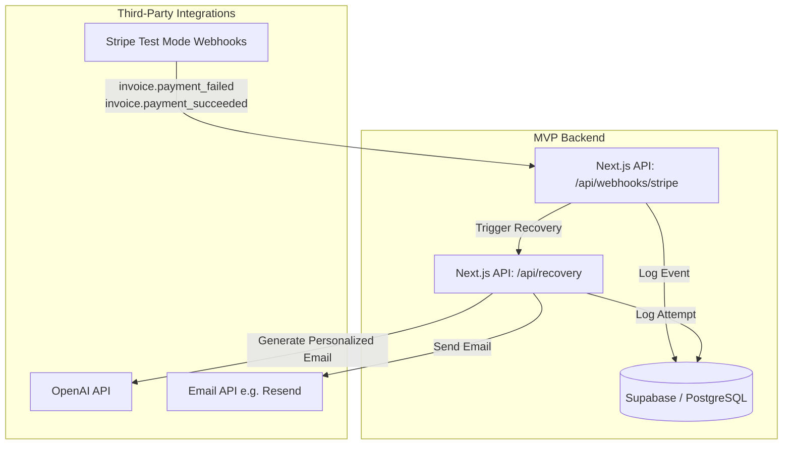

# AI Billing & Leakage Recovery System - MVP Architecture

## 1. System Overview (MVP)

The **AI Billing & Leakage Recovery System MVP** is a streamlined proof-of-concept designed to quickly detect failed Stripe payments and trigger an AI-generated personalized recovery email. 

This version focuses on testing the core value proposition using Stripe Test Mode, a simplified Supabase schema, and OpenAI for email generation, skipping multi-tenant complexities and advanced churn predictions for now.

---

## 2. High-Level Architecture Diagram (MVP)

---

## 3. Data Storage Layer (Supabase / Postgres MVP Schema)

A simplified, single-tenant relational schema focusing only on necessary entities for the MVP.

### Core Tables
1. **`customers`**
   - `id` (UUID), `stripe_customer_id` (String, Unique)
   - `email`, `name` (String)

2. **`subscriptions`**
   - `id` (UUID), `customer_id` (FK)
   - `stripe_sub_id` (String, Unique)
   - `status` (String - active, past_due, canceled)

3. **`invoices`**
   - `id` (UUID), `customer_id` (FK)
   - `stripe_invoice_id` (String, Unique)
   - `amount_due` (Integer/Cents)
   - `status` (String - open, paid, void)

4. **`failed_payments`**
   - `id` (UUID), `invoice_id` (FK), `customer_id` (FK)
   - `amount` (Integer/Cents)
   - `error_code` (String, e.g., `insufficient_funds`, `expired_card`)
   - `status` (String - unresolved, recovered)
   - `created_at` (Timestamp)

5. **`recovery_attempts`**
   - `id` (UUID), `failed_payment_id` (FK)
   - `ai_generated_email_body` (Text)
   - `sent_at` (Timestamp)

6. **`recovered_revenue`**
   - `id` (UUID), `failed_payment_id` (FK)
   - `amount_recovered` (Integer/Cents)
   - `recovered_at` (Timestamp)

---

## 4. Stripe Integration Layer (Test Mode)

### Essential Webhook Events
We listen only to the most critical events to determine payment failure and success:
- **`invoice.payment_failed`**: Creates a record in `failed_payments` and triggers the AI recovery workflow.
- **`invoice.payment_succeeded`**: Checks if this invoice previously failed. If so, marks `failed_payments.status` as `recovered` and logs the amount to `recovered_revenue`.

---

## 5. Leakage Detection & Recovery Engine (MVP)

### 5.1 Simplified Logic
We skip complex pattern recognition (like usage limits or smart retries) and focus purely on reactive recovery.

1. **Trigger:** `invoice.payment_failed` webhook is received.
2. **AI Generation:** The system sends the customer's name, amount due, and decline reason to OpenAI.
   * **Prompt:** _"Write a short, polite recovery email to [Name] whose Stripe payment of $[Amount] failed due to [Decline Reason]. Provide a link to update their payment method: [Link]. Keep it professional but empathetic."_
3. **Delivery:** The generated email is sent via an Email API (e.g., Resend).
4. **Tracking:** The attempt is logged in `recovery_attempts`.

---

## 6. Dashboard / Reporting (Minimal)

A very simple interface (or even a tailored database view/spreadsheet) showing:
* **Failed Payments Feed:** List of recent failures and their AI email status.
* **Recovered Revenue Total:** Sum of amounts from `recovered_revenue`.
* **Recovery Rate:** (Total Recovered Amount / Total Failed Amount) * 100.

---

## 7. Future Enhancements (Post-MVP)

Once the MVP proves the core concept in Test Mode:
1. **Multi-tenant RLS:** Implement Row Level Security in Supabase to support multiple SaaS clients.
2. **Smart Retries:** Schedule retries based on historically successful days/times instead of immediate attempts.
3. **Usage Leakage:** Compare usage logs against plan limits to find underbilled users.
4. **Churn Prediction:** Incorporate complex historical data to assign churn risk scores.
